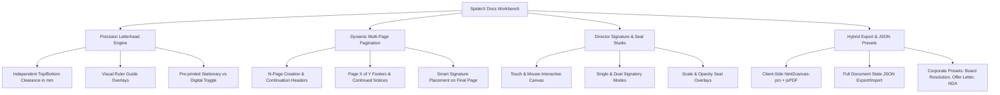
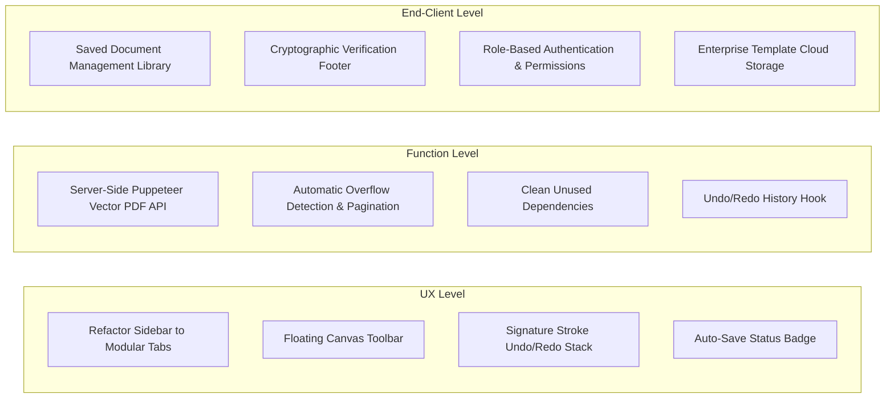

# 🧠 SpiderX Docs — Full Project Analysis & Architectural Context

> **Document Type:** Project Context, Comprehensive Audit & Strategic Optimization Guide  
> **Target Audience:** Product Lead, Engineering Team, UX Designer, Business Stakeholders  
> **System Version:** v1.0 Studio (Next.js 16 App Router + Tailwind CSS v4)  
> **Last Updated:** August 2026  

---

## 📋 Executive Summary

**SpiderX Docs** is a high-precision, executive-grade document creation studio designed for **SpiderX Robotics Pvt. Ltd.**. It bridges the gap between pre-printed corporate stationary and digital PDF generation. The platform enables real-time millimetre-accurate margin clearance controls, dynamic multi-page (N-page) continuation, interactive director signature drawing pads, official seal overlays, and template preset backups.

This document presents a 360-degree technical and strategic evaluation of the codebase: identifying core strengths (**What's Good**), critical architectural and UX limitations (**What's Worst**), and an actionable, step-by-step roadmap for enhancement across **UX/UI Level**, **Function/Code Level**, and **End-Client/Enterprise Operations Level**.

---

## 🌟 1. What's Good (Core Strengths & Technical Highlights)



### 1.1 Precision Letterhead Alignment Engine
- **Independent mm Clearance**: Header Top Margin (`marginTopMm`) and Footer Bottom Margin (`marginBottomMm`) can be adjusted in real-time, ensuring text never overlaps company letterhead headers or footers.
- **Ruler Guide Overlays**: Toggleable dashed guide lines on the live canvas provide visual verification of document margins during editing.
- **Dual Stationary Mode**: Toggling `includeLetterheadInPrint` allows switching between:
  1. Printing on **pre-printed stationary** (hides background SVG/PNG image on print).
  2. Generating **full digital PDFs** (includes high-res letterhead background graphics).

### 1.2 Multi-Page Continuation Engine (N-Page Support)
- **Flexible Page Expansion**: Documents scale smoothly across 1, 2, 3, or N pages.
- **Automated Metadata & Continuation Headers**: Automatically appends reference numbers, page continuation notices (`...Continued on Next Page`), and `Page X of Y` page counters.
- **Smart Signature Placement**: Closing salutations, director signatures, and company seals automatically anchor to the final page of multi-page documents.

### 1.3 Dual Director Signatories & Seal Customization
- **Interactive Canvas Drawing Modal**: Directors can draw signatures with touch or mouse input, exporting transparent vector-like PNG data URLs.
- **Flexible Layout Modes**: Toggle between Single Signatory (Left, Center, Right alignment) and Dual Signatories (Side-by-Side, Stacked, Split-Left-Right layouts).
- **Official Seal Overlay**: Seal/stamp graphics feature customizable scaling (0.5x to 1.5x) and opacity (0.1 to 1.0) for realistic stamp simulation.

### 1.4 Workbench UI & Styling System
- **OKLCH Color Tokens & Dark Mode**: Built with Next.js 16, Tailwind CSS v4, and Radix UI primitives. Includes full light/dark theme switching with persistent preferences.
- **Resizable Sidebar Workbench**: Fixed left controls panel supports drag-to-resize width (280px to 650px) and collapsible icon mode over a ReactFlow dot-matrix grid.

---

## ⚠️ 2. What's Worst (Flaws, Pain Points & Risk Areas)

### 2.1 Technical & Function-Level Flaws

| Flaw Area | Impact | Technical Root Cause |
| :--- | :--- | :--- |
| **Monolithic Component (`ControlsSidebar.tsx`)** | High maintenance overhead, sluggish HMR compilation, high re-render cascades | `ControlsSidebar.tsx` is over 3,000 lines (~152 KB) containing all tabs, form controls, rich text editors, resize listeners, and JSON parsers in a single file. |
| **No Automatic Page Text Overflow** | Text visual clipping; overflow content hides off-canvas | Canvas pages have fixed height `height: 297mm; overflow: hidden`. Paragraphs must be manually split between Page 1 and Page 2+. Long content on Page 1 does not flow automatically. |
| **Unused Heavy Dependencies & Empty API Route** | Bloated `node_modules` (~300MB+), unused packages | `puppeteer` and `puppeteer-core` are listed in `package.json` but unused in frontend. `app/api/generate-pdf/` directory is completely empty. |
| **Raster PDF Captures (Non-Selectable Text)** | PDF text is converted to image canvas; unsearchable, large file sizes | PDF export relies on `html2canvas-pro` screenshot capture. Exported PDFs contain image bitmaps rather than native vector text and embedded SVG paths. |
| **Single LocalStorage Slot (Data Loss Risk)** | User accidentally resets default or switches templates and loses hours of work | Document state is saved to a single key (`spiderx_letterhead_doc`). No document history, draft revisions, or multi-document storage library exists. |

### 2.2 UX & UI Level Flaws
- **Decoupled Form vs. Canvas Editing**: Users must modify text in sidebar textareas/Quill editors on the left and check the canvas on the right. No direct click-to-edit capability on canvas elements.
- **No Signature Undo History**: The signature drawing pad only provides a "Clear Canvas" button. Slipping on a signature stroke forces the user to erase the entire signature.
- **Fixed Zoom Controls Location**: Canvas zoom control is tucked inside the sidebar tab rather than floating directly near the canvas viewport.

### 2.3 End-Client & Enterprise Level Flaws
- **No Access Control or Signature Authentication**: Any user can draw signatures and export official company documents without user authentication, digital audit logs, or role-based permissions (Director vs. HR vs. Staff).
- **No Digital Integrity Verification**: Exported documents lack cryptographic signatures, timestamping, or verification barcodes required for enterprise legal compliance.
- **No Cloud Database Sync**: Custom templates and document drafts exist only in local browser storage. Clearing browser cache deletes all saved work.

---

## 🚀 3. Comprehensive Improvement Roadmap



---

### 🎨 Level 1: UX / Design & Usability Enhancements

#### 1. Modular Sidebar Architecture
Break `ControlsSidebar.tsx` (3,000 lines) into dedicated, self-contained sub-components under `components/sidebar/`:
- `AlignmentTab.tsx`: Page margin sliders, ruler toggles, background opacity.
- `RecipientTab.tsx`: Recipient details, designation, toggle visibility.
- `DocumentBodyTab.tsx`: Main heading, sub-headings, subject style, paragraph manager, tables.
- `SignatoryTab.tsx`: Single/Dual signatory controls, director details, DIN numbers, seal scale/opacity.
- `TemplatesTab.tsx`: Corporate template loader, JSON backup/restore, custom template saver.

#### 2. Floating Canvas Toolbar
Add a bottom-right floating toolbar on the canvas area containing:
- Zoom In (`+`), Zoom Out (`-`), Reset Zoom (`100%`).
- Toggle Margin Guides (`Ruler icon`).
- Toggle Fullscreen Workbench Mode.

#### 3. Touch & Canvas Drawing Improvements
Enhance `SignaturePadModal.tsx`:
- Add **Undo Stroke (`Ctrl+Z`)** keeping an array of historical canvas states (`ImageData[]`).
- Support preset pre-approved signature image uploads for authorized directors.

#### 4. Live Auto-Save Indicator
Display a subtle real-time status pill in `HeaderNavbar.tsx`:
- `✓ Saved locally`
- `⚡ Unsaved changes`
- `📁 Restored from draft`

---

### ⚙️ Level 2: Function & Code Architecture Enhancements

#### 1. Server-Side Vector PDF API (`app/api/generate-pdf/route.ts`)
Implement the empty `generate-pdf` API route using Puppeteer:
- Converts document HTML into real vector PDFs with selectable text, embedded fonts, and small file size (~100 KB vs ~3 MB raster PDF).
- **Fallback**: Keep `html2canvas-pro` client-side export as an offline offline-capable backup.

```typescript
// app/api/generate-pdf/route.ts sketch
import { NextResponse } from 'next/server';
import puppeteer from 'puppeteer';

export async function POST(req: Request) {
  const { htmlContent } = await req.json();
  const browser = await puppeteer.launch({ headless: true });
  const page = await browser.newPage();
  
  await page.setContent(htmlContent, { waitUntil: 'networkidle0' });
  const pdfBuffer = await page.pdf({
    format: 'A4',
    printBackground: true,
    margin: { top: '0mm', right: '0mm', bottom: '0mm', left: '0mm' },
  });

  await browser.close();
  return new NextResponse(pdfBuffer, {
    headers: {
      'Content-Type': 'application/pdf',
      'Content-Disposition': 'attachment; filename="SpiderX_Document.pdf"',
    },
  });
}
```

#### 2. Dynamic Content Overflow Detection
Implement an off-screen calculation DOM ref measurement to detect when Page 1 content exceeds `297mm`:
- Automatically split paragraphs into Page 2 overflow array or display a visual warning badge (`⚠️ Content exceeds Page 1 height by 24mm`).

#### 3. State History Hook (`useDocumentHistory`)
Wrap document state in an undo/redo stack manager supporting `Ctrl+Z` (Undo) and `Ctrl+Y` (Redo) for state changes.

---

### 🏢 Level 3: End-Client, Business & Enterprise Operations

#### 1. Multi-Document Library (IndexedDB / Local Database)
Replace single-slot LocalStorage with an interactive **Document Manager**:
- Store list of saved documents with title, reference number, date created, and thumbnail preview.
- Enable document search, duplicate, delete, and export all.

#### 2. Digital Integrity Audit Trail & Verification Barcode
Add an optional compliance footer on official documents:
- **Verification Hash**: SHA-256 hash of document body + signatory metadata.
- **Verification Barcode / QR**: Scannable QR code linking to official SpiderX document verification endpoint.

#### 3. Corporate Role-Based Access Control (RBAC)
- **Role Permissions**:
  - `Admin / Director`: Can draw/upload official signatures and authorize letters.
  - `Manager / HR`: Can fill document templates and submit for approval.
  - `Viewer`: Can view and download approved documents.

---

## 🛠️ Summary Matrix of Recommendations

| Category | High Priority (Immediate) | Medium Priority (Next Sprint) | Long Term (Enterprise) |
| :--- | :--- | :--- | :--- |
| **UX / UI** | Modularize `ControlsSidebar.tsx`, add floating canvas zoom toolbar | Add Undo/Redo to Signature Pad Modal, inline canvas click-to-edit | Fullscreen focus mode, dark mode preview toggle |
| **Function** | Build `app/api/generate-pdf` Puppeteer vector PDF route | Auto-overflow height calculator & page warning badges | IndexedDB multi-document state manager with `useHistory` undo/redo |
| **Enterprise** | Local document list & auto-save indicator | Document JSON search & template export gallery | RBAC authentication, digital signature verification QR code |

---

Developed with ❤️ for **SpiderX Robotics Pvt. Ltd.**
