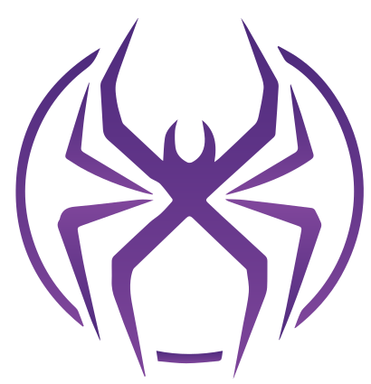

# 🤖 SpiderX Docs — Executive Letterhead & Document Studio

<div align="center">

  

  **Official Document Creation Studio for SpiderX Robotics Pvt. Ltd.**

  [](https://nextjs.org/)
  [](https://react.dev/)
  [](https://www.typescriptlang.org/)
  [](https://tailwindcss.com/)
  [](#-license--credits)

</div>

---

## 🌟 Overview

**SpiderX Docs** is a high-precision, executive-grade document creation platform designed specifically for **SpiderX Robotics Pvt. Ltd.** to streamline corporate communication, official board resolutions, offer letters, MOUs, NDAs, and project proposals. 

It bridges the gap between pre-printed physical stationary and digital document distribution by providing **real-time millimetre-accurate margin clearance guides**, **dynamic multi-page (N-Page) continuation**, **interactive director signature pads**, **official seal overlays**, and **built-in document presets**.

---

## ✨ Key Feature Suite

### 📐 1. Precision Letterhead Alignment Engine
- **Independent Clearance Overrides (mm)**: Set millimetre-exact Header Top Margin (`marginTopMm`) and Footer Bottom Margin (`marginBottomMm`) to ensure content never collides with printed logos or footers.
- **Visual Ruler Guides**: Toggle dashed visual margin overlays on the live editor canvas for instant alignment feedback.
- **Pre-Printed vs. Digital PDF Mode**: Choose between printing on physical stationary (hides background on print) or exporting full digital PDFs (embeds background stationary image).

### 📄 2. Dynamic Multi-Page Engine (N-Page Support)
- **Unlimited Page Creation**: Expand documents seamlessly across 1, 2, 3, or N continuation pages.
- **Automated Continuation Headers & Footers**: Displays reference numbers, continuation titles, `Page X of Y` page numbers, and custom notices (e.g. `...Continued on Next Page`).
- **Smart Signature Anchoring**: Automatically anchors closing salutations, director signatures, and company seals to the final page of multi-page documents.

### ✍️ 3. Director Signature & Official Seal Studio
- **Interactive Signature Drawing Pad**: Draw smooth transparent signatures directly using mouse or touchscreen devices.
- **Dual Signatories Support**: Toggle between **Single Director (1 Signatory)** and **Dual Directors (2 Signatories)** modes with side-by-side or stacked layout configurations.
- **Official Corporate Seal / Stamp Overlay**: Upload company stamp graphics with live scale (0.5x to 1.5x) and opacity (0.1 to 1.0) controls.

### 🎨 4. Studio Workbench UI & Styling
- **ReactFlow Dot Grid Canvas**: Live A4 editor canvas rendered over a modern dot-matrix workbench grid.
- **Resizable Sidebar**: Fixed left controls panel with drag-to-resize width (280px to 650px) and collapsible icon mode.
- **Light & Dark Mode**: Native OKLCH design token color system with dark mode toggle and local storage persistence.

### 💾 5. Export, Backup & Template Workflow
- **Hybrid PDF Export**: One-click direct PDF export (`html2canvas-pro` + `jsPDF`) and native browser print formatting for A4 (`210mm x 297mm`) output.
- **JSON Backup / Restore**: Export complete document configurations to `.json` backup files and restore them anytime.
- **Built-in Presets**: Pre-loaded corporate templates (Official Authorization Letter, Board Resolution, Service Quote, NDA).

---

## 🛠️ Tech Stack & Architecture

| Technology | Purpose | Description |
| :--- | :--- | :--- |
| **[Next.js 16](https://nextjs.org/)** | Framework | App Router with Turbopack bundler for high-speed development |
| **[React 19](https://react.dev/)** | Frontend UI | Component architecture & client-side state management |
| **[TypeScript 5](https://www.typescriptlang.org/)** | Type Safety | Strict interfaces for document schemas, pages, and layout settings |
| **[Tailwind CSS v4](https://tailwindcss.com/)** | Styling | OKLCH color design system, gradient utilities, and print media queries |
| **[Shadcn UI](https://ui.shadcn.com/)** | Components | Radix UI primitives (Button, Card, Input, Badge, Dialog) |
| **[Quill.js](https://quilljs.com/)** | Rich Text | WYSIWYG rich text editor for formatting resolution content and tables |
| **[html2canvas-pro](https://github.com/niklasvh/html2canvas)** | Capture | Modern canvas capture engine with OKLCH CSS color function support |
| **[jsPDF](https://github.com/parallax/jsPDF)** | PDF Engine | Client-side A4 PDF file generation |

---

## 🚀 Getting Started

### Prerequisites

Ensure you have **Node.js 18+** and **npm** installed on your system.

### Installation

1. **Clone the Repository**:
   ```bash
   git clone https://github.com/spiderxrobotics/spiderx_docs.git
   cd spiderx_docs
   ```

2. **Install Dependencies**:
   ```bash
   npm install
   ```

3. **Run Development Server**:
   ```bash
   npm run dev
   ```

4. **Open in Browser**:
   Navigate to [http://localhost:3000](http://localhost:3000).

---

## 📁 Project Directory Structure

```text
spiderx_docs/
├── app/
│   ├── api/
│   │   └── generate-pdf/   # PDF Generation API endpoint
│   ├── globals.css         # OKLCH Design System, print styles & canvas grid
│   ├── layout.tsx          # Root HTML layout & Google Font declarations
│   └── page.tsx            # Main Studio Workbench page & document state
├── components/
│   ├── ControlsSidebar.tsx # Fixed resizable control panel with tabbed forms
│   ├── HeaderNavbar.tsx    # Top navigation bar, theme toggle & print/PDF actions
│   ├── LetterheadCanvas.tsx# Live A4 document canvas with N-page renderer
│   ├── RichTextEditor.tsx  # Dynamic Quill.js WYSIWYG editor component
│   ├── SignaturePadModal.tsx# Canvas-based digital signature drawing modal
│   └── ui/                 # Shadcn UI primitives (Button, Card, Input, Badge)
├── lib/
│   └── utils.ts            # Classname merging utilities (clsx & tailwind-merge)
├── types/
│   └── letterhead.ts       # TypeScript interfaces for documents, pages & layout
├── utils/
│   ├── defaultTemplates.ts # Corporate templates & default SVG assets
│   └── pdfExporter.ts      # Direct client-side PDF export engine
├── PROJECT_CONTEXT.md      # Comprehensive Architectural Analysis & Audit Report
└── README.md               # Project Documentation
```

---

## 📊 Comprehensive Audit & Roadmap Context

For a detailed technical audit of strengths, architectural bottlenecks, and strategic enhancement guides across **UX Level**, **Function Level**, and **Enterprise Operations Level**, view the full context document:

👉 **[Read PROJECT_CONTEXT.md](PROJECT_CONTEXT.md)**

---

## 📄 License & Credits

Developed with ❤️ for **SpiderX Robotics Pvt. Ltd.**  
All rights reserved © 2026 SpiderX Robotics. Proprietary internal enterprise software.
